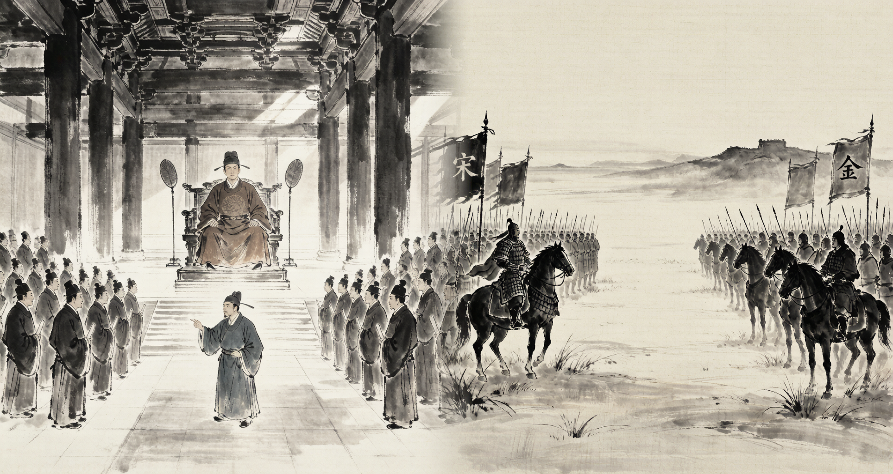
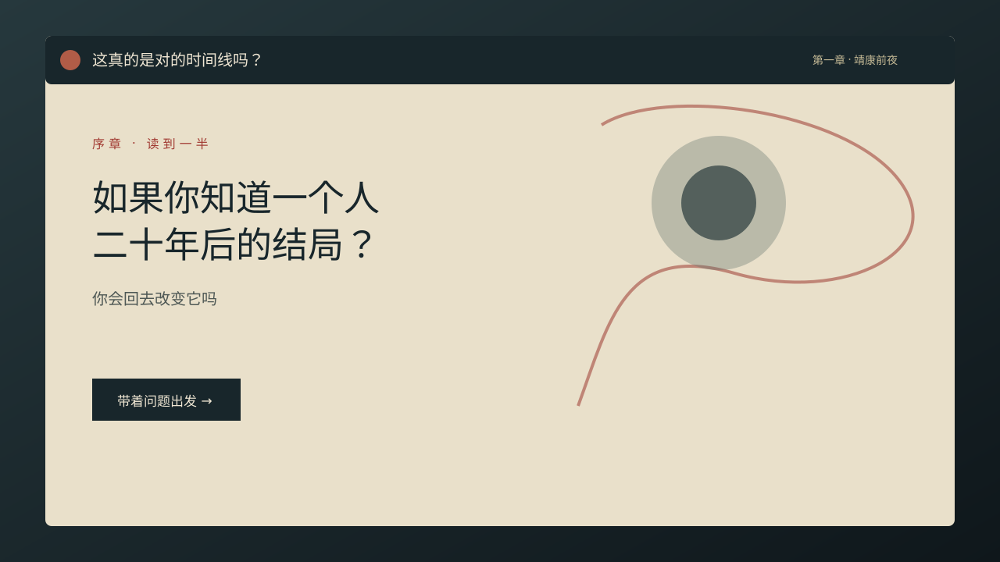

<div align="center">



# 《这真的是对的时间线吗？》

### *Is This Really the Right Timeline?*

**只要有问题，就有回答**

[](LICENSE)
[](https://www.zhihu.com/)
[](https://github.com/)
[](https://github.com/MOHE007/is-this-the-right-timeline)

</div>

一个大四学生穿越进没读完的知乎文章世界，在 AI 向导刘看山的陪伴下，沿着三章历史切片追问：知道结局之后，我们真的能改变什么吗？

## 🎬 Demo 预览

<div align="center">

</div>

**15 分钟 · 文字线索 · 多结局**

👉 [在线体验 Demo1（GitHub Pages）](https://mohe007.github.io/is-this-the-right-timeline/)

## ✨ Features

- **问题驱动叙事**：每一次提问都会改变你理解历史的方式。
- **线索交叉验证**：家书、军令、路线图与普通人证言共同组成消息链。
- **三章三种玩法**：文字调查、横版动作、3D 探索逐章升级。
- **AI 向导三档帮助**：提醒、回答、救助；回答遵循「事实 → 背景 → 反问」。
- **离线可通关**：本地问答库保证 Demo 在没有联网增强时仍然完整可玩。
- **数据驱动内容**：人读 Markdown，运行时消费 JSON，叙事与引擎彼此独立。

## 🎮 三章玩法

| 章节 | 时间切片 | 核心玩法 | 玩家要回答的问题 |
| --- | --- | --- | --- |
| 第一章 · 靖康前夜 | 1122 → 1142 | 文字调查 / 线索拼图 | 知道结局，是否要介入？ |
| 第二章 · 戚家军 | 明代沿海 | 横版动作 / 队伍协作 | 纪律与保护，如何同时成立？ |
| 第三章 · 淞沪 | 1937 | 3D 探索 / 资源选择 | 记住一座城，需要留下什么？ |

## 🤖 AI 机制：刘看山三档帮助

| 档位 | 触发方式 | 输出 |
| --- | --- | --- |
| **提醒** | 玩家停留或线索缺口 | 指向下一条可调查对象，不直接给答案 |
| **回答** | 玩家主动提问 | 事实 → 背景 → 反问，帮助玩家建立自己的判断 |
| **救助** | 连续失败或卡关 | 给出最小必要提示，同时保留选择后果 |

联网增强通过 `ask(question, context)` 适配层接入；不可用时自动切换到离线本地问答库。

## 🚀 Quick Start

三步即可运行第一章：

```bash
git clone https://github.com/MOHE007/is-this-the-right-timeline.git
cd is-this-the-right-timeline/demo1
python3 -m http.server 4173
```

打开 <http://localhost:4173>，也可以直接双击 `demo1/index.html`。

## 📁 目录结构

```text
is-this-the-right-timeline/
├── README.md
├── LICENSE
├── CONTRIBUTING.md
├── .github/workflows/deploy-pages.yml
├── demo1/                         # 第一章可运行浏览器 Demo
├── docs/                          # 策划、玩法与制作包 Markdown
│   ├── product-plan.md            # 初审产品说明计划书
│   ├── production/                # 剧本 / 冻结表 / 实现规格 / 调查与时间线卡
│   └── agent-handoff/             # 给协作者的拉取、验收与 PR 提示词
├── data/ch1/                      # 运行时状态、内容与资源清单 JSON
├── assets/                        # 原创水墨素材与 Demo 预览图
└── godot/.gitkeep                 # Godot 4.x 工程预留
```

### 素材原件放在哪里

代码仓库只保存**代码与小配置**。体积大的素材原件（美术包 70MB、音频母版 50MB、
卡片工程源 58MB 等）归档在**私有仓库** `MOHE007/ithrtt-assets`，**开发游戏不需要它**——
运行时用到的资源已经是优化后的 WebP / OGG，就在本仓库 `godot/demo2/assets/` 下。

需要重制素材（换尺寸、换压缩、改 3D 模型）时才去私有仓库取原件；取用与恢复流程见
该仓库的 `README.md`。

## 🛠 技术路线

- **目标引擎**：Godot 4.x + GDScript，最终导出 Web。
- **内容管线**：Markdown 服务编剧与审校；JSON 服务运行时加载、校验和状态机。
- **第一章契约**：14 个冻结 `scene_id`（`s01_modern_article` 至 `s14_xinqiji_intro`）。
- **状态系统**：状态变量、条件与效果描述调查进度、信任、介入倾向和结尾选择。
- **结局路由**：`ending_divergent`、`ending_canonical`、`ending_truth` 三种结局，经 `s11_outcome_router` 汇总后进入 `s12_leave_or_continue`。
- **AI 适配**：统一调用 `ask(question, context)`，离线问答库作为稳定兜底。

## 🧪 Demo2 Godot 占位运行时

`godot/demo2/` 已建立最小 Godot 4.x 工程，加载 `data/ch1/` 的内容与状态 JSON，使用占位画面验证 14 个场景和选择推进。梁博森的最终美术通过 `resource_id` 接入 `godot/demo2/assets/art/`，不需要改剧情数据。Godot 4.3 实跑、三路线冒烟测试和截图已归档到 `godot/demo2/docs/run-2026-09-13/`。

## 🔐 知乎 OAuth 登录服务

`zhihu-oauth/` 是按官方 `zhihu-hackathon-skill_v2026s2` 初始化的独立 Node OAuth 服务。OAuth 后端优先使用 Render Free，Godot 游戏静态包继续使用 GitHub Pages。初始化、Secrets、回调和免费部署步骤见 [`docs/production/zhihu_oauth_free_deployment_v01.md`](docs/production/zhihu_oauth_free_deployment_v01.md)。

## 📄 项目复盘论文

[《多智能体协作下的叙事游戏工程实践》](docs/papers/multi-agent-narrative-game-engineering.md) —
本项目的完整工程复盘：创作思路的理论框架、三层契约与数据驱动运行时、多 AI 协作架构与审校闭环、
工具能力矩阵，以及 **12 条可复刻实践、5 条反模式、4 条真实弯路**。全文 53 条参考文献。

> **为什么值得一读**：本文写的不是"我们做成了什么"，而是**"什么做法真的起了作用、什么做法看起来对但实际失效"**。
> §8.2 的四条弯路（CDN 缓存错配导致产物打不开、把签名失效误判为内存不足、按文件名核对交付物、多 AI 共用工作区）是最难通过正向描述传递的部分。

| 格式 | 链接 |
| --- | --- |
| 正文（Markdown，GitHub 可直接阅读） | [multi-agent-narrative-game-engineering.md](docs/papers/multi-agent-narrative-game-engineering.md) |
| PDF（A4 19 页，已嵌入中文字体） | [multi-agent-narrative-game-engineering.pdf](docs/papers/multi-agent-narrative-game-engineering.pdf) |
| Word（含导航大纲，可编辑） | [multi-agent-narrative-game-engineering.docx](docs/papers/multi-agent-narrative-game-engineering.docx) |
| 文档导出工具链 | [docs/papers/tools/](docs/papers/tools/) |

## 🗺 Roadmap

| 里程碑 | 状态 | 交付物 |
| --- | --- | --- |
| **M0 · 方向冻结** | ✅ 已达成 | 引擎路线、视觉方向、三章玩法框架 |
| **M1 · 第一章垂直切片** | 🔄 Godot 占位流程已验证 | 剧本、分镜、角色卡、线索卡、状态/内容 JSON、实现规格；待美术接入、字体和 Web 导出 QA |
| M2 · 第二章原型 | ⏳ 计划中 | 戚家军横版动作核心循环 |
| M3 · 第三章原型 | ⏳ 计划中 | 淞沪 3D 探索核心循环 |
| M4 · 三章串联 | ⏳ 计划中 | 选择与记忆跨章节传递 |
| M5 · Web 发布 | 🔄 Demo1 已上线 | GitHub Pages 公网体验 |
| M6 · 比赛验收 | ⏳ 计划中 | 可演示构建、素材清单与交接文档 |

## 👥 团队

**王凯**（导演） · **梁博森**（美术 / UI） · **Codex**（叙事 / 系统） · **Marvis**（审校） · **DSH Desktop**（整合）

## 📜 License & IP

代码与团队原创水墨素材采用 [MIT License](LICENSE)。本页 Hero 宣传图为项目方提供素材，按项目方授权展示，不改变其原有权利归属。刘看山形象版权归知乎，本项目仅在「知乎黑客松 2026」比赛期间使用；赛后如需商用或再分发，须另行取得授权。公开仓库不包含知乎官方素材包。

## 🥚 通关彩蛋

> 刚才打的那些不是游戏，都是你在知乎上没读完的问题。

<div align="center">如果你也在追问，欢迎带着自己的问题开一条分支。</div>
