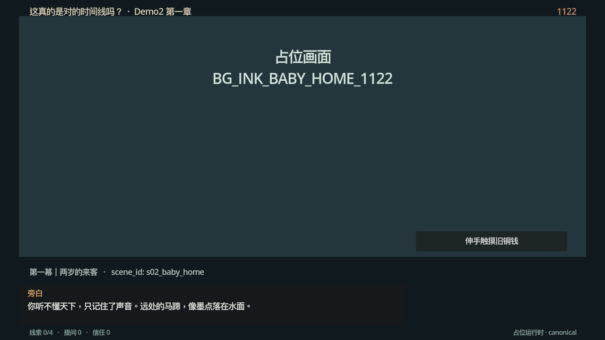
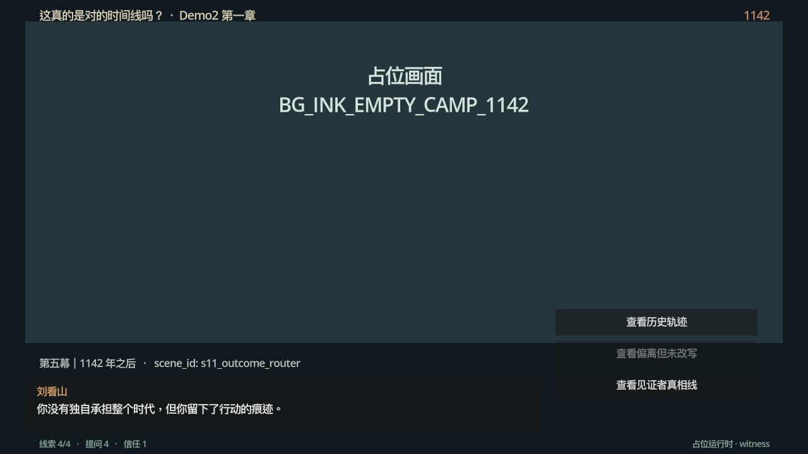

# Demo2 Godot 占位运行时

这是《第一章 南宋意难平》的最小 Godot 4.x 接入工程，当前使用占位画面，目的是先验证 JSON 内容管线、14 个 `scene_id`、对话推进、条件选择和结局跳转。

## 已验证的运行环境（2026-09-13 实跑回填）

- **Godot 版本**：`4.3.stable.official.77dcf97d8`（macOS universal，Apple M2，OpenGL API 4.1 Metal · GL Compatibility）
- **导入**：`godot --headless --path . --import` 通过，无告警。
- **实跑**：`main.tscn` 正常运行，中文文本经系统字体回退正常渲染（注意：Web 导出没有系统字体回退，接入美术时需捆绑 CJK 字体）。
- **冒烟测试**：三条结局路线（divergent / canonical / truth）全部自动通关并命中预期 `ending_id`，见 `docs/run-2026-09-13/smoke_test.log`。
- **运行截图**：`docs/run-2026-09-13/`（序章、s08、s11 路由、s14 truth 结局）。

| 序章 | s11 结局路由（witness 线，divergent 正确锁灰） |
| --- | --- |
|  |  |

## 运行

用 Godot 4.x 打开本目录并运行 `main.tscn`。运行前可先执行静态契约校验：

```bash
python3 tools/validate_content.py
```

无头冒烟测试（模拟玩家走三条结局路线并断言 `ending_id`）：

```bash
godot --headless --path . -s res://tools/smoke_test.gd
```

自动通关录屏（Movie Maker 逐帧输出 PNG，用于回归截图）：

```bash
godot --path . --write-movie /tmp/demo2_tour/frame.png --fixed-fps 10 --resolution 1280x720 res://tools/qa_tour.tscn
```

## 美术接入位置

- `assets/art/`：梁博森最终资源（目录已用 `.gitkeep` 保留）。
- `assets/placeholders/`：占位说明。
- 运行时由 `resource_id` 绑定资源，不改剧情 JSON 和场景 ID。
- JSON：`data/ch1/`。

## 当前限制

当前已支持：

- 14 个场景加载与推进；
- `condition` / `conditions` 条件按钮锁定（JSON 显式 `null` 视为无条件）；
- 线索、提问类型、军中信任、分支、三种结局和离开/继续状态；
- 每个场景的 `visual` / `ui_slot` 作为美术接入锚点。

已知问题与契约备注：

- state 契约 `effects_catalog.resolve_intervention_branch` 写的是无条件 `set branch=intervene`，但 content 在 s10 对两条路线复用该效果；运行时已按语义只在 intervene 线生效（否则见证线会在 s11 死锁）。**待 Codex 在 v02 契约中修订。**
- `_finish` 的多行结束语会溢出 90px 高的对话框（占位阶段可接受，接 UI 资源时随对话框重做）。
- Web 导出需捆绑 CJK 字体（默认字体不含中文，桌面端靠系统回退）。

仍待完成：完整刘看山本地问答适配、保存点、窄窗口检查和 Web 导出；Godot 桌面端占位流程已完成实跑与三路线冒烟验证。
