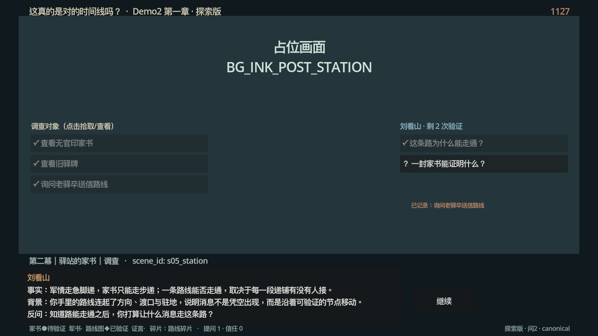
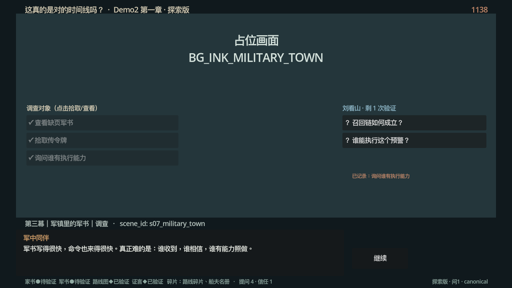

# Demo2 Godot 占位运行时（探索版 v02）

这是《第一章 南宋意难平》的 Godot 4.x 接入工程。当前为探索版：JSON 契约（v01 基础 + v02 补丁）驱动 14 个场景、调查对象、拾取/验证状态、刘看山有限问答和条件路由，画面仍用占位资源。

## 探索版 v02 已接入（2026-09-14 实跑回填）

- **数据驱动引擎**：effects（`set`/`increment`/`decrement`/`append_unique`、`effect:param` 参数替换）与 conditions（`all`/`any`/`eq`/`gte`/`lte`/`contains`、命名条件递归）全部从合并契约解释执行，不再硬编码。
- **调查按钮**（工作包 D）：s05/s06/s07 各 3 个调查对象，未查看/已拾取状态、`once` 语义、`investigation_counts` 计数；离开场景漏拿关键物时触发 `remember_missed_clue` 与 `fallback_feedback`。
- **线索栏**：四类物证显示 `·未拾取 / ●待验证 / ◆已验证`，附碎片与错过列表。
- **刘看山问答**（工作包 E）：本地问答库 `data/ch1/demo2_ch1_shan_answers_v02.json`（三段式 fact/context/counter_question）；预算 3 次；缺道具返回 `insufficient` 且照常消耗；耗尽返回 `exhausted`；离线可完整通关。
- **条件路由**：`ending_rules_patch` 把 s11 门槛别名到 `divergent_ready_v02`/`truth_ready_v02`——特殊结局必须经过真实验证；三门全锁时提供「普通收束」兜底（运行时桥，待 content v03 正式节点），漏线索不 Game Over。
- **冒烟测试 5/5**（工作包 G 五条路径）：完整验证→divergent；有物证无验证→不得进 divergent、走普通收束；四证+证言解读→truth；全程不调查→canonical+错过记录；提问耗尽→不死锁。见 `docs/run-2026-09-14-exploration/smoke_test_5routes.log`。
- **对 Marvis 阻塞项的实证**：S2-4——divergent 完整链只需 2 次提问（执行者可由「询问军中同伴」免费获得），预算 3 次数学成立；S2-5——同时满足时 s11 由玩家选择，不会死锁，判定序 truth > divergent > canonical 建议写入 v03 契约。

| s05 调查+刘看山验证 | s07 调查面板 |
| --- | --- |
|  |  |

## 已验证的运行环境

- **Godot 版本**：`4.3.stable.official.77dcf97d8`（macOS universal，Apple M2，OpenGL API 4.1 Metal · GL Compatibility）
- **导入**：`godot --headless --path . --import` 通过，无告警。
- **实跑**：`main.tscn` 正常运行，中文经系统字体回退正常渲染（Web 导出需捆绑 CJK 字体）。
- 基础版（v01）实跑证据保留在 `docs/run-2026-09-13/`。

## 运行

用 Godot 4.x 打开本目录并运行 `main.tscn`。运行前可先执行静态契约校验（含 v02 合并、调查对象、问答库检查）：

```bash
python3 tools/validate_content.py
```

无头冒烟测试（五条 QA 路径，断言结局、错过记录、提问预算与兜底路由）：

```bash
godot --headless --path . -s res://tools/smoke_test.gd
```

自动通关录屏（含调查与问答动作，Movie Maker 逐帧输出 PNG）：

```bash
godot --path . --write-movie /tmp/demo2_tour/frame.png --fixed-fps 10 --resolution 1280x720 res://tools/qa_tour.tscn
```

## 数据文件

- `data/ch1/demo2_ch1_content_v01.json` + `demo2_ch1_content_v02_patch.json`：场景、beats、调查对象（运行时按**字段级**合并）。
- `data/ch1/demo2_ch1_state_v01.json` + `demo2_ch1_state_v02.json`：初始状态、effects 目录、条件与结局门槛（补丁合并）。
- `data/ch1/demo2_ch1_shan_answers_v02.json`：刘看山本地问答库（草稿，待 Marvis 审校文案）。
- `data/ch1/demo2_ch1_manifest_v01.json`：场景与资源 ID 映射。

## 美术接入位置

- `assets/art/`：梁博森最终资源（目录已用 `.gitkeep` 保留）。
- 运行时由 `resource_id` 绑定资源，不改剧情 JSON 和场景 ID。
- 新增 UI 槽位待接：调查按钮 hover、拾取 toast、线索卡「待验证/已验证」印章、刘看山能力面板（先用占位样式跑通）。

## 已知问题与契约备注（待 Codex v03）

- `content_v02_patch.json` 的 `merge_rule` 写作 "replace scenes by id"，但补丁场景不含 `beats`/`year`/`visual`，照字面替换会清空场景——运行时按**字段级合并**执行，请在 v03 修正措辞。
- 原补丁中调查对象 ID `old_station牌` 混入中文字符，已改为 `old_station_plate`（docs/production 与工程内同步修正）。
- `resolve_intervention_branch` 仍是无条件 `set branch=intervene`，运行时继续按语义守卫（仅 intervene 线生效）。
- v01 `find_*` 效果把 `evidence_completeness` 写成固定值（1/2/3/4），与拾取顺序相关；运行时改为按 `clues_found` 实际数量重算。
- s11「普通收束」目前是运行时兜底按钮，建议 v03 在 content 中补正式节点与文案。
- 三结局同时满足时的判定序（truth > divergent > canonical）待写入契约。

仍待完成：保存点、窄窗口检查、Web 导出（捆绑 CJK 字体）、美术资源接入。
